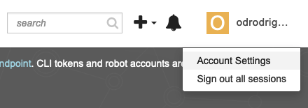
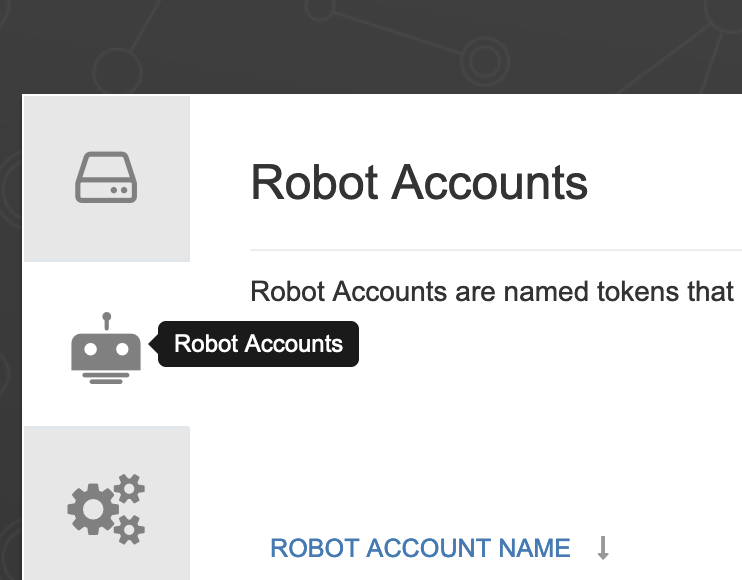
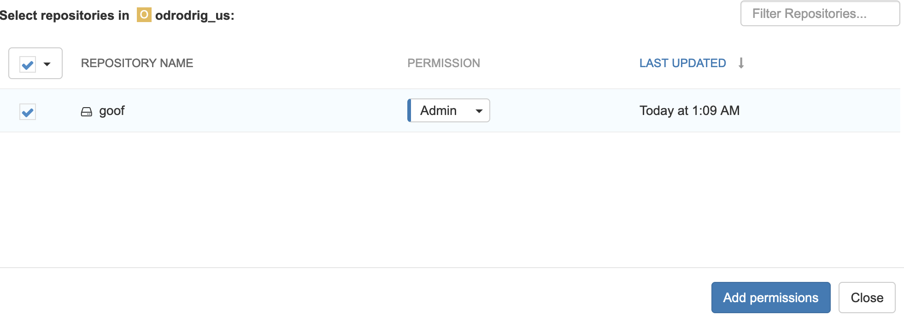
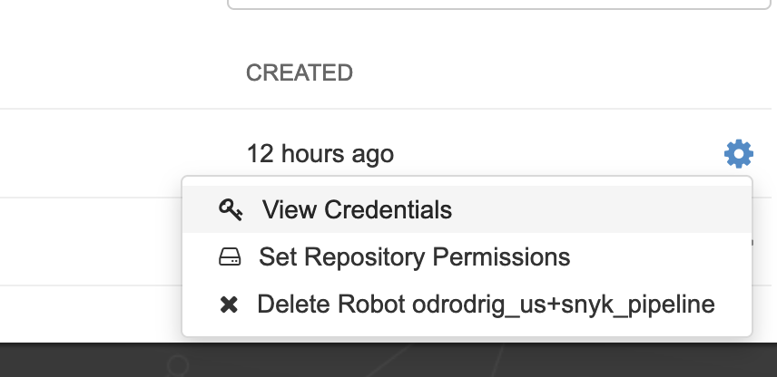
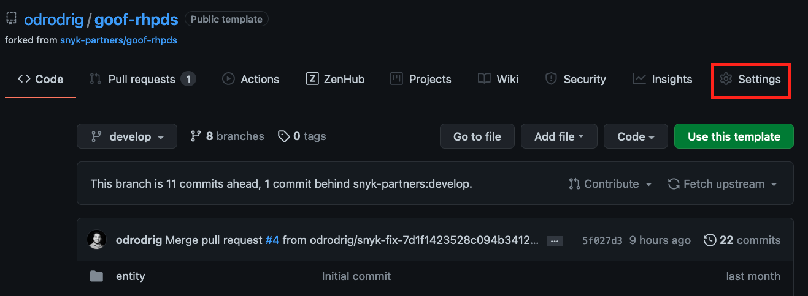
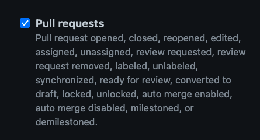
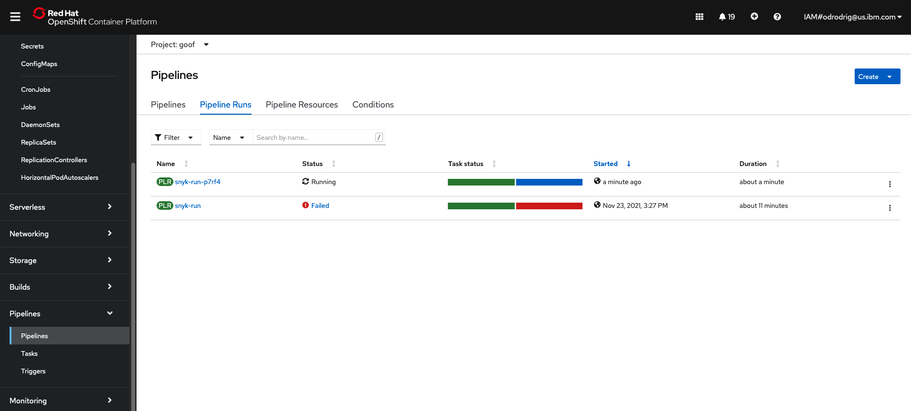
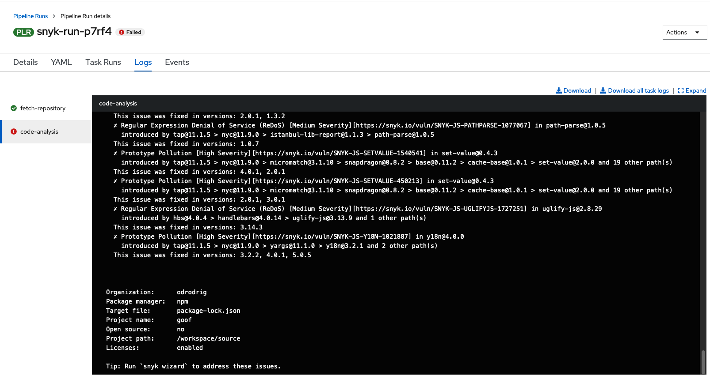

# Tekton Pipeline using Snyk task

## Setup

1. Ensure that you have completed all of the [prerequisites](https://github.com/snyk-partners/snyk-rhpds/blob/add-tekton/prerequisites.md) before continuing. 

1. The repo that you cloned in the prerequisties has a deployment file that we must edit before we deploy later on. This file currently points to the main Goof repo but instead we need to point to your copy of the repo.

    - In a code editor open up `./manifests/goof-deployment` and look at line 19.

        ```yaml
        image: snyklabs/goof:latest #Edit with your Quay ID
        ```

    - Remove `snyklabs` and add `quay.io/<your quay username>` replacing `<your quay username>` with your actual quay username. For example, my username is odrodrig_us so my line 19 will look like this:

        ```yaml
        image: quay.io/odrodrig_us/goof:latest #Edit with your Quay ID
        ```

    - Save the file when you are done.

1. Install the Tekton tasks

    1. Install git-clone task

        ```bash
        oc apply -f https://raw.githubusercontent.com/tektoncd/catalog/v1beta1/git/git-clone.yaml
        ```

    1. Install snyk-node task

        ```bash
        oc apply -f https://raw.githubusercontent.com/garethr/snyk-tekton/master/node/node.yaml
        ```

    1. Install Kaniko task (For building container images)

        ```bash
        kubectl apply -f https://raw.githubusercontent.com/tektoncd/catalog/main/task/kaniko/0.5/kaniko.yaml
        ```

    1. Install the deploy-using-kubectl task

        ```bash
        kubectl apply -f pipeline/deploy-using-kubectl.yaml
        ```

1. In order to use Snyk from our pipeline we will need a service account that will authenticate with Snyk. For this workshop, a service account has already been created for you and the token that will be used for authentication is already in the command below:

1. Run the following command, to create the secret with the Snyk service account token

    ```bash
    oc create secret generic snyk --from-literal=token=e83425dd-b269-42fb-9926-7a333793dc56
    ```

    This token will only be available for the duration of the workshop.


## Setting up access to Quay
1. For this application we will be using the Quay container registry to store our container images. First we need to create a new repository in order to push images with our robot account.

    Navigate to [http://www.quay.io](http://www.quay.io)

1. Click on the `Create New Repository` button near the top right of the page.

    

1. Click on your username at the top right corner of the page and select `Account Settings`

    

1. Then, click on the tab on the left side of the page that looks like a robot.

    

1. Next, click on the blue `Create Robot Account` button on the right side of the page.

1. In the new dialog that appears give the robot a name like, `snyk_pipeline`. When done, click `Create Robot Account` at the bottom of the dialog window.

1. Then, on the next page, click on the checkbox next to the `goof` repository and in the `Permission` dropdown select `Admin`. When done, click on `Add Permissions`.

    

1. Next we need the credentials of the new robot account. Click on the settings icon to the right of the robot accounts table and select `View Credentials`.

    

1. You should now see the username and password for the robot account. Keep this page up and navigate back to your terminal.

1. Enter the following command and paste the username from the Quay robot account

    ```bash
    export REGISTRY_USERNAME=
    ```

    Press enter when done.

1. Then, enter the following command and paste in the password from the Quay robot account.

    ```bash
    export REGISTRY_PASSWORD=
    ```

    Press enter when done.

1. Next, we need to create the secret in OpenShift with these credentials so that we can authenticate with the registry from our pipeline. Run the following command to create the secret:

    ```bash
    oc create secret docker-registry quay-secret --docker-server=https://quay.io --docker-username=$REGISTRY_USERNAME --docker-password=$REGISTRY_PASSWORD
    ```

1. Now that the secret has been created, we need to give the Pipeline service account on OpenShift access to it so that it can be used in the build pipeline.

    ```bash
    oc secrets link pipeline quay-secret
    ```

1. Then, we need to add an annotation to our secret so that it can be used in Tekton.

    ```bash
    oc annotate secret quay-secret tekton.dev/docker-0=quay.io
    ```

## Create OpenShift Pipeline Components

1. Apply the pipeline

    ```bash
    oc apply -f pipeline/pipeline.yaml
    ```

1. Create a PVC for pipeline to use

    ```bash
    oc apply -f pipeline/snyk-pvc.yaml
    ```

1. Before we create the automation for Tekton, we need to make a change to our TriggerTemplate file. In a code editor, open `./pipeline/triggers/triggerTemplate.yaml` and go to line 28.

- Line 28 should look like the following:

    ```yaml
    value: quay.io/<quay_user>/goof
    ```

- Replace `<quay_user>` with your Quay username. For example, my Quay username is `odrodrig_us` so my line 28 will look like this:

    ```yaml
    value: quay.io/odrodrig_us/goof
    ```

    Save the file when done.

1. Create the Tekton Triggers components

    ```bash
    oc apply -f pipeline/triggers/
    ```

1. Next, in order to get webhook events from GitHub we need to create a secret. This secret isn't like an authentication token but rather a string that will be used to match the incoming events to ensure that we are listening to the correct webhook.

    ```bash
    oc create secret generic github-token --from-literal=token=1234567
    ```

1. One of the resources we created is the EventListener which acts as a sink to accept webhook events such as pull_request events from GitHub. By default, this service is only available internal to the cluster so we need to expose it to outside traffic via an OpenShift Route.

    ```bash
    oc expose service el-github-pr
    ```

1. Now we need to get the route that we just created so that we can create a webhook on GitHub.

    ```bash
    oc get route el-github-pr --template='http://{{.spec.host}}'
    ```

    Copy the URL that is returned.

## Creating the GitHub webhook

1. Navigate to your version of the goof repository and click on the `Settings` button.

    

1. Click on `Webhooks` in the left side of the page and click on the `Add Webhook` button that appears on the right side of the Webhooks page.

1. Now we need to configure the webhook:

    - For `Payload URL` enter the EventListener route that you copied previously.

    - For `Content-Type` select `Application/JSON`

    - For `Secret` enter `1234567`

    - Then select the `Let me select individual events` radio button

        - A list of events should appear. Scroll down and select `Pull_requests`

        

    - Next, scroll down and click on `Add webhook`.

With that configured, our pipeline will be triggered to build on any pull request opened. This will allow us to test out potential changes in a Pull Request before merging with our main branch.

(Optional) However, if you would like to run the pipeline manually, you can do the following:

- Open `./pipeline/pipeline-run.yaml` in a code editor

- Change the `GitUrl` and `ImageUrl` to point to your own resources.

- Run the Pipeline

    ```bash
    oc create -f pipeline/pipeline-run.yaml
    ```

## Viewing the Pipeline

1. Navigate to your openshift cluster console and find the Pipelines section on the left navigation menu, and select Pipelines.
1. From the Pipelines page select the tab that says Pipeline Runs.

    

1. You will then be able to see the status of the build process using the pipeline.
    - There are 5 steps:
        - Clone the code and store it in the PVC that was created
        - Import the project to snyk
        - Scan the code with Snyk
        - Build and push the container image
        - Deploy the application

1. If you view the output of the `snyk-test` step you can see the output of the Snyk scan.

    
